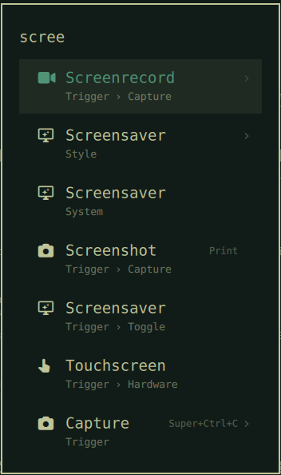

# Keycap

**Your keybindings, where you already look.**

Omarchy ships a keybindings list behind `Super+K`, but that is a place you have
to go. Keycap puts the answer in the menu you open anyway: press `Super+Space`,
type three letters, and the shortcut is sitting next to the name.



```
Chromium              Super+Shift+B
Screenshot                    Print
Capture                Super+Ctrl+C
Apps                Super+Alt+Space
```

You stop looking things up, and you start noticing the shortcut for the thing
you just clicked. That is how a keybinding gets learned.

## What it covers

Applications, settings panels, submenus and one-shot actions — anything the
Omarchy menu lists that a Hyprland binding actually reaches. Rows without a
binding simply show nothing.

## How it finds them

`hyprctl binds` reports every Omarchy binding as dispatcher `__lua` with an
opaque argument, so the command behind a key is not visible there. Keycap
recovers it the way `omarchy-menu-keybindings` does: `bin/keycap-resolve`
replays `~/.config/hypr/hyprland.lua` through a shim that records nothing but
the `bind` calls. The shim is lifted out of the installed Omarchy script at run
time rather than copied, so it keeps tracking upstream.

Each binding is then matched against the row it belongs to, most precise first:

| Map | Keyed on | Reaches |
| --- | --- | --- |
| `byApp` | desktop entry id | Chromium, Files, Docker, YouTube, WhatsApp, Google Maps |
| `byCmd` | the exact command the row runs | Screenshot, Transcode, Lock, Keybindings |
| `byRoute` | the submenu a binding opens | Apps, System, Capture, Theme, Share |
| `byName` | the binding's own description | everything else, by name |

Web apps match on the URL their `.desktop` entry and their binding share.
`omarchy-launch-browser` and `omarchy-launch-terminal` are resolved through
`xdg-settings` and `xdg-terminals.list`, so the hint lands on **Chromium** and
**foot** rather than on a row named "Browser".

Run the resolver on its own to see what Keycap will show:

```bash
~/.config/omarchy/plugins/io.github.maxmad75.keycap/bin/keycap-resolve | jq
```

First run takes about a second and a half. After that it answers in ~50 ms from
a cache keyed on `hyprctl binds` plus your application directories, so a rebind
shows up the next time you open the menu.

## Install

```bash
omarchy plugin add https://github.com/MaxMad75/omarchy-keycap.git --enable
omarchy restart shell
```

The restart is required, not optional. Bar widgets hot-reload; a `menu` plugin
does not — the shell logs "Local plugin changed, reloading" and keeps running
the old code until it restarts.

### What enabling changes

Keycap is a fork of Omarchy's own menu plugin and declares
`omarchy.clonedFrom: "omarchy.menu"`. Enabling it therefore does what any
Omarchy clone does: `omarchy.menu` moves to `disabledPlugins` in
`~/.config/omarchy/shell.json`, and `Super+Space` routes here instead. Nothing
else in your configuration is touched, and Keycap itself never writes to it.

## Remove

```bash
omarchy plugin remove io.github.maxmad75.keycap
omarchy restart shell
```

That restores `omarchy.menu` and your original `Super+Space`. The only other
thing Keycap leaves behind is its cache:

```bash
rm -f ~/.cache/omarchy/keycap-*.json
```

## Know before you install

**Keycap replaces the Omarchy menu with a fork of it.** The menu is roughly
1,400 lines of Quickshell QML, and this repository carries a copy taken from
Omarchy 4.0.0. Improvements Omarchy makes to its own menu will not reach you
while Keycap is enabled, and after a large `omarchy update` the fork can drift.
If the menu misbehaves after an update, diff it against
`/usr/share/omarchy/shell/plugins/menu/` before assuming Keycap is at fault —
or remove Keycap, which restores the shipped menu in one command.

This is the honest cost of the feature: Omarchy's menu rows have no extension
point for a trailing column, so there is no way to add one without forking.

## How it handles its own inputs

Everything Keycap reads is local, but the shell process it runs inside is
long-lived and shared, so local input is still treated as untrusted:

- The cache lives in `~/.cache/omarchy/`, a directory other tools write to. It
  is published through a temporary file in that same directory plus an atomic
  rename, so a symlink planted at the destination is replaced rather than
  followed and truncated. Reading validates the **opened descriptor** through
  `/proc/self/fd` — regular file, owned by this user, within 1 MiB, parsing to
  the expected shape — so nothing can be swapped in between the check and the
  read.
- The whole resolve runs under a 20 s deadline and every external step under
  8 s, so a wedged `hyprctl` cannot stall the menu.
- Bindings, desktop entries, matches and total output are capped, and `Menu.qml`
  enforces its own 512 KiB ceiling on what it will accumulate from the resolver.

Any of these limits being hit yields an empty result, and the menu renders
exactly as it did before.

## Requirements

Omarchy 4 (Quattro) with `omarchy-shell`. The resolver uses `hyprctl`, `lua`,
`jq`, `xdg-settings` and `omarchy-menu-keybindings` — all of which a stock
Omarchy install already has. No network access, no other external dependencies.
If any of them is missing, the resolver returns empty maps and the menu renders
exactly as it did before.

## License

MIT — see [LICENSE](LICENSE). `Menu.qml`, `MenuModel.js` and `BarWidget.qml`
are derived from the [Omarchy](https://github.com/basecamp/omarchy) menu plugin,
Copyright (c) David Heinemeier Hansson, also MIT; see [NOTICE](NOTICE).
